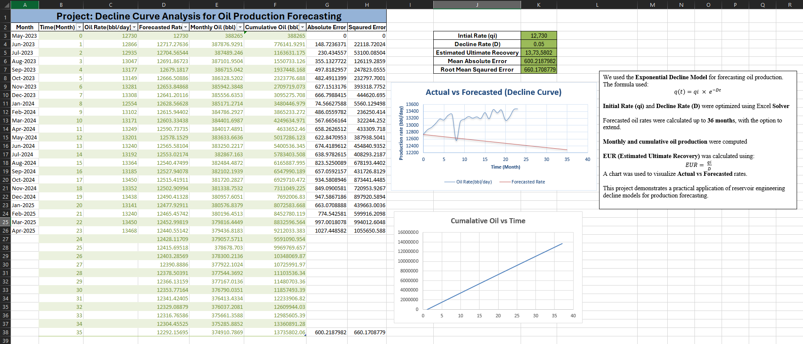

# 📉 Decline Curve Analysis for Oil Production Forecasting

This project demonstrates how to apply **Exponential Decline Curve Analysis** to forecast oil production using real-world production data and Microsoft Excel.

---

## 📌 Objective

Forecast oil production over time using historical data, calculate cumulative production, and estimate **EUR (Estimated Ultimate Recovery)**.

---

## 🛠 Tools Used

- Microsoft Excel
- Excel Solver (for optimization)
- Basic statistical functions
- Perplexity (for technical guidance)

---

## 📈 Key Features

- Actual vs Forecasted Oil Rate Chart
- Cumulative Oil vs Time Chart
- Optimized values for:
  - Initial Rate (qi)
  - Decline Rate (D)
- Monthly & cumulative oil production
- Error analysis (Absolute & Squared Errors)
- EUR calculation

---

## 📐 Methodology

We used the **Exponential Decline Model**:

q(t) = q_i × e^{-Dt}

Where:
- \( q_i \): Initial production rate
- \( D \): Decline rate
- \( t \): Time (in months)

EUR was estimated using:

EUR = q_i / D

> 📌 The production forecasting methodology and calculations were created using Microsoft Excel, with technical support and model design insights sourced from **Perplexity**.

---

## 📊 Preview

---

## 🔍 What I Learned

- Practical implementation of reservoir engineering models
- Using Excel Solver for parameter fitting
- Production forecasting techniques
- Data visualization for engineering decisions
- Leveraging AI tools like Perplexity for technical modeling support

---

## 📁 Files in this Repo

| File | Description |
|------|-------------|
| `Decline_Curve_Analysis.xlsx` | Main Excel model |
| `Preview.png` | Dashboard screenshot |
| `README.md` | Project documentation |

---

## 🙌 Let's Connect!

If you're working on similar projects or want to collaborate, feel free to reach out on [LinkedIn](https://www.linkedin.com/in/nicholas-anil-koshy).
